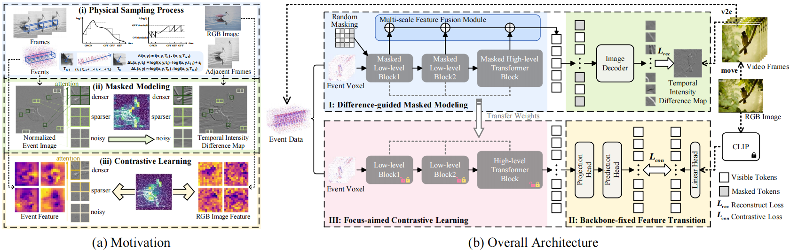

# Revealing Latent Information: A Physics-inspired Self-supervised Pre-training Framework for Noisy and Sparse Events (ACM MM 2025)
<h4 align="center">Lin Zhu, Ruonan Liu, Xiao Wang, Lizhi Wang, Hua Huang</h4>

## 🎯Introduction

This study proposes a **self-supervised pre-training framework to fully reveal latent information in event data**, including edge information and texture cues.
Our framework consists of three stages:
**Difference-guided Masked Modeling**, inspired by the event physical sampling process, reconstructs temporal intensity difference maps to extract enhanced information from raw event data.
**Backbone-fixed Feature Transition** contrasts event and image features without updating the backbone to preserve representations learned from masked modeling and stabilizing their effect on contrastive learning.
**Focus-aimed Contrastive Learning** updates the entire model to improve semantic discrimination by focusing on high-value regions.
Extensive experiments show our framework is robust and consistently outperforms state-of-the-art methods on various downstream tasks, including object recognition, semantic segmentation, and optical flow estimation.

  

## ✨News
- **[2025-10-26]** Code released.
- **[2025-07-06]** Paper accepted by ACM MM 2025. 
  
## 💌Acknowledgement
Thanks to the following open-source works for their help and inspiration: [ConvMAE](https://github.com/Alpha-VL/ConvMAE), [MoCo v3](https://github.com/facebookresearch/moco-v3), [GreenMIM](https://github.com/LayneH/GreenMIM), [ECDP](https://github.com/Yan98/Event-Camera-Data-Pre-training), [ECDDP](https://github.com/Yan98/Event-Camera-Data-Dense-Pre-training), [MEM](https://github.com/tum-vision/mem), [BEiT](https://github.com/w86763777/pytorch-ddpm), [ES-ImageNet](https://github.com/lyh983012/ES-imagenet-master), [ESS](https://github.com/uzh-rpg/ess), [DECIFlow](https://github.com/danqu130/DCEIFlow), [Layer-Grafted](https://github.com/VITA-Group/layerGraftedPretraining_ICLR23), [EvRepSL](https://github.com/VincentQQu/EvRepSL), [v2e](https://github.com/SensorsINI/v2e), [CLIP](https://github.com/openai/CLIP), etc.
