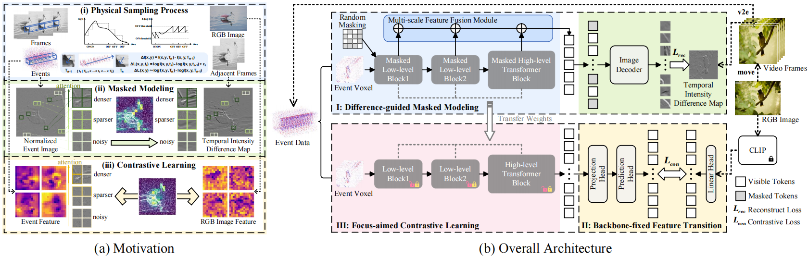

# Revealing Latent Information: A Physics-inspired Self-supervised Pre-training Framework for Noisy and Sparse Events (ACM MM 2025)

  

<h4 align="center">Lin Zhu, Ruonan Liu, Xiao Wang, Lizhi Wang, Hua Huang</h4>

## 🎯Introduction

This study proposes a **self-supervised pre-training framework to fully reveal latent information in event data**, including edge information and texture cues.
Our framework consists of three stages:
**Difference-guided Masked Modeling**, inspired by the event physical sampling process, reconstructs temporal intensity difference maps to extract enhanced information from raw event data.
**Backbone-fixed Feature Transition** contrasts event and image features without updating the backbone to preserve representations learned from masked modeling and stabilizing their effect on contrastive learning.
**Focus-aimed Contrastive Learning** updates the entire model to improve semantic discrimination by focusing on high-value regions.
Extensive experiments show our framework is robust and consistently outperforms state-of-the-art methods on various downstream tasks, including object recognition, semantic segmentation, and optical flow estimation.

  

## ✨News
- **[2026-07-12]** Checkpoints and datasets released.
- **[2025-10-26]** Code released.
- **[2025-07-06]** Paper accepted by ACM MM 2025.

## ⚙️Reqirements
- python
- pytorch
- timm
- clip
- ptflops
- hdf5plugin
- tensorboard
  
## 🤖 Pre-trained Checkpoints
|Backbone|after MM|after MM-Trans-CL|
|:-:|:-:|:-:|
|ViT|[OneDrive](https://1drv.ms/u/c/d7ca46a8d1a0a9a4/IQDcgep9dHhETaNYRJHwtX91Adi_D2BLpNLXi1tz73atvdg?e=voh1A4) / [BaiduDisk](https://pan.baidu.com/s/1VAPKSf3uUasKeNFJuP8oug?pwd=156a)|[OneDrive](https://1drv.ms/u/c/d7ca46a8d1a0a9a4/IQDcgep9dHhETaNYRJHwtX91Adi_D2BLpNLXi1tz73atvdg?e=voh1A4) / [BaiduDisk](https://pan.baidu.com/s/13UbFvl5qCAU5nFZTgpc3gA?pwd=axa2)|
|ConvViT|[OneDrive](https://1drv.ms/u/c/d7ca46a8d1a0a9a4/IQB-5tPRym-JSY63iiF-Y3s-AZlvDOyh7N3y29gTpmHHKiY?e=rMcC3t) / [BaiduDisk](https://pan.baidu.com/s/15VqJLycscAU-umiPKWhKWw?pwd=dpqy)|[OneDrive](https://1drv.ms/u/c/d7ca46a8d1a0a9a4/IQDKLXeFEgOZR7cmo48QtEV2AdpiHOedR3cR0xNvcRxPs28?e=weuzmO) / [BaiduDisk](https://pan.baidu.com/s/16zPAw0XNOQhO-z1szTaQ7A?pwd=fwfh)|
|Swin|[OneDrive](https://1drv.ms/u/c/d7ca46a8d1a0a9a4/IQBYr3hoVPJvR47dSE5kHpozAY8GTrdjI7mDi8rHYAyhTvk?e=hNzW6z) / [BaiduDisk](https://pan.baidu.com/s/1Mp1W1ycINL5hTgf2q5zyyQ?pwd=jhhc)|[OneDrive](https://1drv.ms/u/c/d7ca46a8d1a0a9a4/IQCT_yrzmAElQp_laDJ3Eyb5AWjM9kR8KICkLT0qs4pF-O4?e=IgYSJ0) / [BaiduDisk](https://pan.baidu.com/s/1Z8ZyvLSbcuHC2dUcUbJifA?pwd=aizc)|

## 🗂️Datasets
|Task|Datasets|
|:-:|:-|
|Pre-training|[Organized](https://pan.baidu.com/s/1BzE6GaIHjL1wKj4qbhHaxA?pwd=cnif) \| [Original](https://pan.baidu.com/s/1oTSPtldYSWHXM2M7sN02lQ?pwd=ptxi)|
|Object Recognition|[N-Caltech101](https://pan.baidu.com/s/1dROI31Nxqk99sIa54TcC3A?pwd=rr8y) \| [CIFAR10-DVS](https://pan.baidu.com/s/1h1G_JaIIbiHdBkkck9082w?pwd=zgfg) \| [N-Cars](https://pan.baidu.com/s/17S7nkx3avGjX7TlfHl2mqw?pwd=9c7h) \| [N-ImageNet](https://pan.baidu.com/s/1K_R0Wz6W3ovgrONTZbLE4Q?pwd=cz7p) \| [ES-ImageNet](https://pan.baidu.com/s/1qb8D5GjN8XOz4ORX41Kl_w?pwd=jvvc)|
|Semantic Segmentation|[DDD17](https://pan.baidu.com/s/1uAUnrs8Ew_bL_GlEBB6nVQ?pwd=1v29) \| [DSEC](https://pan.baidu.com/s/1ksZMrT9B_BpdOegSB7baOg?pwd=7zpz)|
|Optical Flow Estimation|[MVSEC](https://pan.baidu.com/s/1bcszR2eXItl3DUK_DMHEIg?pwd=r64x)|

## 🚀Inference and Training
Please refer to Tables S16–S18 in the paper's supplementary material, or contact me if you have any questions.

## 💌Acknowledgement
Thanks to the following open-source works for their help and inspiration: [ConvMAE](https://github.com/Alpha-VL/ConvMAE), [MoCo v3](https://github.com/facebookresearch/moco-v3), [GreenMIM](https://github.com/LayneH/GreenMIM), [ECDP](https://github.com/Yan98/Event-Camera-Data-Pre-training), [ECDDP](https://github.com/Yan98/Event-Camera-Data-Dense-Pre-training), [MEM](https://github.com/tum-vision/mem), [BEiT](https://github.com/w86763777/pytorch-ddpm), [ES-ImageNet](https://github.com/lyh983012/ES-imagenet-master), [ESS](https://github.com/uzh-rpg/ess), [DECIFlow](https://github.com/danqu130/DCEIFlow), [Layer-Grafted](https://github.com/VITA-Group/layerGraftedPretraining_ICLR23), [EvRepSL](https://github.com/VincentQQu/EvRepSL), [v2e](https://github.com/SensorsINI/v2e), [CLIP](https://github.com/openai/CLIP), etc.
